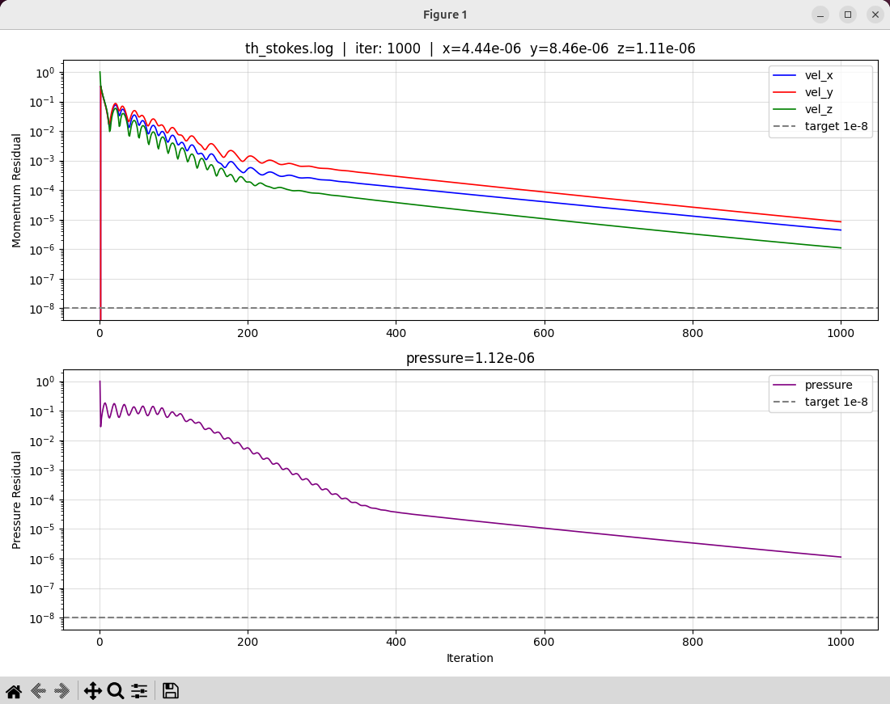

# 工作日誌 2026-04-23

## 今日目標
診斷 th.i SIMPLE 求解器發散問題，找出根本原因並建立收斂的初始條件。

## 工作內容

### 診斷流程（控制變量法）

#### Step 1：移除能量方程式 → th_pure_flow.i
- 結論：純流場仍然立刻發散（inf）
- 確認：問題不在能量方程式

#### Step 2：移除湍流方程式 → th_laminar.i
- 發散發生在第一次 Turbulence Iteration
- 確認：問題在 k-ε 湍流方程式
- 但移除湍流後，純層流也發散
- 殘差模式：x/y 方向從 0 增長（球形幾何反射力，物理正確）
- 但壓力週期性從收斂跳回 1.0 → 非線性對流項問題

#### Step 3：移除重力項
- 改善有限（從 3 iter 延長到 21 iter 才崩潰）
- 確認：重力不是主因

#### Step 4：移除對流項 → th_stokes.i（Stokes 流）
- 第一次成功不發散！
- 1000 iteration 後：x=4.4e-6, y=8.5e-6, z=1.1e-6, p=1.1e-6
- 確認：問題根源是**對流項非線性 + 冷啟動**

### 根本原因分析
- NekRS MSFR tutorial 用 `startFrom = restart.fld`（熱啟動）
- 我們從全零冷啟動，對流項 ρ(v·∇)v 在 v≈0 時不穩定
- 解決方案：用 Stokes 解作為完整版的初始條件

### Stokes 解收斂結果
- 1000 iterations，約 35 分鐘（2100 秒）
- 最終殘差：momentum ~1e-6，pressure ~1e-6
- Checkpoint 儲存於：th_stokes_checkpoint_cp/0001

### 新增工具
- monitor.py：SIMPLE 殘差即時監控工具
  - 支援任意 log 檔：python3 monitor.py [log檔名]
  - 自動處理 ANSI 顏色碼
  - 每 3 秒更新，semilogy 對數座標顯示

## 明日計劃
1. 修改 th_laminar.i：
   - 加入 restart_file_base = 'th_stokes_checkpoint_cp/0001'
   - 加入 [Outputs] checkpoint
   - 加入 continue_on_max_its = true
2. 跑含對流項的層流版本，觀察是否收斂
3. 若層流收斂 → 加回湍流（th_pure_flow.i + restart）
4. 若湍流收斂 → 加回能量方程式（完整 th.i + restart）

## 今日學習重點
- SIMPLE 分離式求解器：動量+壓力永遠綁在一起
- 能量方程式在常數物性下與流場單向耦合
- 冷啟動 vs 熱啟動：非線性 N-S 方程式對初始條件敏感
- Stokes 流（無對流）是線性問題，一定收斂，適合作為初始條件
- Side sets：嵌入 Exodus 格式的面集合，供邊界條件使用

## 檔案清單
- th_pure_flow.i：無能量方程式版本
- th_laminar.i：無湍流版本
- th_stokes.i：無對流項版本（Stokes 流，已收斂）
- th_stokes_checkpoint_cp/：Stokes 收斂解 checkpoint
- th_stokes_out.e：Stokes 收斂解 Exodus 輸出（可用 Paraview 視覺化）
- monitor.py：殘差即時監控工具

## 收斂圖

診斷過程中產生的壓力＋動量收斂曲線：

圖中顯示 Stokes 流（無對流項）冷啟動 1000 iterations 的殘差曲線，
momentum ~1e-6，pressure ~1e-6，確認收斂。
此 checkpoint 作為後續含對流項版本的熱啟動初始條件。

## SIMPLE 演算法原理補充

### 為什麼沒有時間項但仍然有「迭代」？

穩態求解器的目標是直接找到 ∂/∂t = 0 的平衡狀態，
不模擬物理過程如何隨時間演化，所有時間項 ∂/∂t 直接消失。

但 N-S 方程式有一個根本困難：**速度和壓力互相依賴**。
- 動量方程式需要壓力梯度 ∇p 才能解速度
- 壓力沒有自己獨立的方程式

SIMPLE（Semi-Implicit Method for Pressure-Linked Equations）
的解法是「輪流猜測、修正」：

**每一個 iteration 做四件事：**
1. 猜壓力場 p*（第一次用初始值，之後用上一輪結果）
2. 用 p* 解動量方程式 → 得到速度場 v*（此時不滿足質量守恆）
3. 解壓力修正方程式 → 得到修正量 p'
   → 更新 p = p* + p'，同步修正 v
4. 檢查殘差：修正量夠小 → 收斂；不夠小 → 回到步驟 1

**結論：** 收斂圖橫軸的 iteration 推進的是「壓力與速度互相修正的次數」，
與時間無關。這也是為什麼 Stokes 流（線性，無對流項）
比完整 N-S（非線性）更容易收斂——非線性對流項 ρ(v·∇)v
會讓壓力修正方程式變得不穩定，尤其在冷啟動（v≈0）時。
